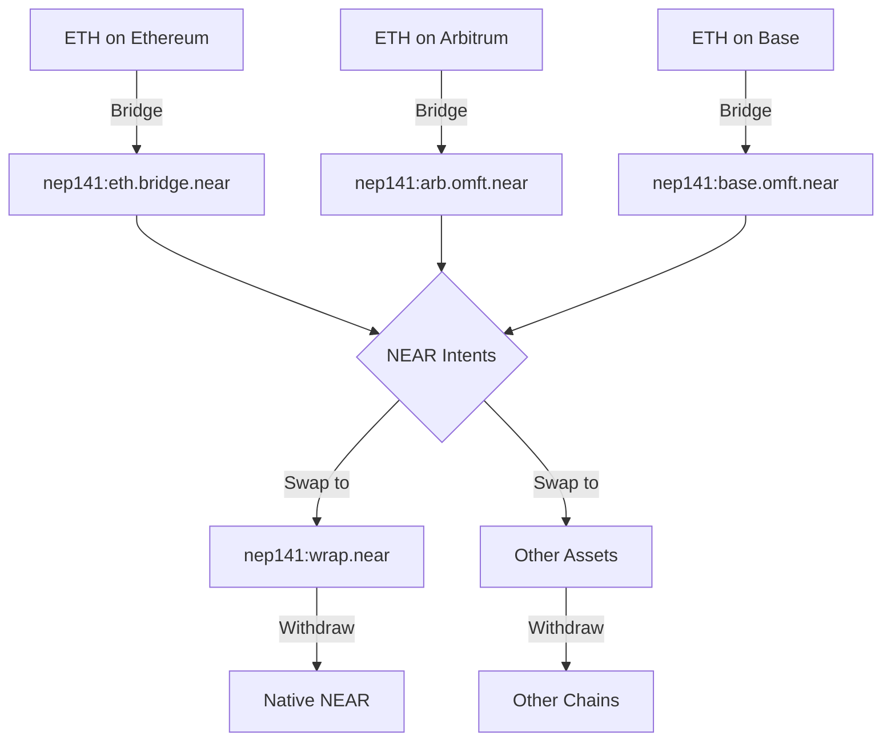

# 2.1: Understanding Multi-Token Assets

**Estimated Time:** 15 minutes  
**Prerequisites:** Basic blockchain and token concepts  
**Learning Objectives:**
- Understand how single tokens can exist across multiple blockchains
- Learn about NEAR's multi-asset token standards
- Grasp the concept of bridged vs. native token representations

## Introduction

In the previous module, we introduced the concept of cross-chain swaps. Now, let's dive deeper into one of the most important concepts: how a single token like ETH can exist in multiple forms across different blockchains.

## The Multi-Chain Token Reality

**Web2 Parallel:** Think of how your money exists in different forms - cash in your wallet, digital balance in your bank account, credit on your credit card, and points in your loyalty program. Each represents the same underlying value but exists in different systems with different rules.

**Web3 Approach:** Similarly, ETH exists as native ETH on Ethereum, wrapped ETH on other chains, and bridged representations across various blockchains. Each form serves the same purpose but operates within different blockchain ecosystems.

## NEAR's Multi-Asset Token Standard

NEAR Intents leverages a powerful multi-asset token standard that allows a single conceptual token to have multiple representations. Let's explore this with a practical example.

### ETH Across Multiple Chains

When you interact with NEAR Intents, you'll encounter ETH in several forms:

```json
{
  "nep141:eth.bridge.near": "Ethereum Mainnet ETH",
  "nep141:eth.omft.near": "General cross-chain ETH", 
  "nep141:base.omft.near": "Base network ETH",
  "nep141:arb.omft.near": "Arbitrum ETH"
}
```

Each identifier represents the same underlying asset (ETH) but from different source chains or bridge implementations.

### Token ID Structure

NEAR Intents uses a specific format for token identification:

```
nep141:<contract_address>
```

Where:
- `nep141` indicates the NEAR token standard
- `<contract_address>` specifies the exact contract managing that token representation

## Core Concept: Bridge vs. Native Assets

> **CORE CONCEPT: Bridged Assets**
> 
> When you move ETH from Ethereum to NEAR, you're not actually moving the ETH itself. Instead:
> - Your ETH gets locked in a bridge contract on Ethereum
> - An equivalent amount of "bridged ETH" gets minted on NEAR
> - This bridged ETH represents a claim on the locked ETH
> - When you withdraw, the bridged ETH is burned and the original ETH is released
> 
> This is similar to how a bank deposit receipt represents your actual money held in the vault.

## Asset Balance Tracking

Each token representation maintains separate balances. You might have:
- 0.5 ETH from Ethereum (`nep141:eth.bridge.near`)
- 0.3 ETH from Arbitrum (`nep141:arb.omft.near`)
- 0.2 ETH from Base (`nep141:base.omft.near`)

Despite all being "ETH," these are tracked as distinct assets within the NEAR Intents system.

## The Power of Unified Swapping

Here's where NEAR Intents becomes powerful:



All these different ETH representations can be:
- Swapped for any other supported asset
- Combined in liquidity pools
- Used interchangeably in many protocols

## Checking Your Multi-Asset Balances

To view your balances across all token representations, you'll use commands like:

```bash
near view intents.near mt_batch_balance_of '{
  "account_id": "your-account.near", 
  "token_ids": [
    "nep141:wrap.near",
    "nep141:eth.bridge.near", 
    "nep141:eth.omft.near",
    "nep141:base.omft.near",
    "nep141:arb.omft.near"
  ]
}' --networkId mainnet
```

This returns an array showing your balance for each token representation.

## The 1Click API Advantage

**Web2 Parallel:** The 1Click API is like a universal currency exchange that handles all the complexity of converting between different currency forms automatically.

**Web3 Approach:** Instead of manually managing bridges, gas fees across chains, and complex routing, the 1Click API:
- Generates quotes across all available token representations
- Handles optimal routing automatically
- Manages cross-chain complexity behind a simple interface
- Provides unified pricing across all chains

## Summary

Understanding multi-token assets is crucial for working with NEAR Intents:

- Single tokens exist in multiple blockchain-specific forms
- Each form is tracked separately with unique identifiers
- NEAR Intents can swap between any supported representations
- The 1Click API abstracts away the complexity of managing multiple forms

## Next Steps

Now that you understand how tokens exist across multiple chains, let's explore the 1Click API that makes working with these assets simple and powerful.

Continue to [1Click API Overview](mdc:../02-understanding-cross-chain-assets/02-1click-api-overview.md) 