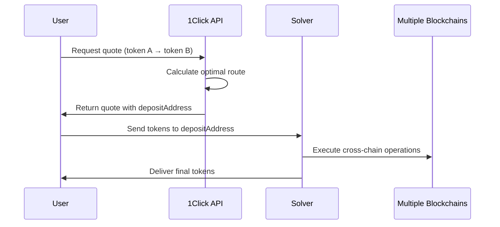

# 1Click API Overview

**Estimated Time:** 20 minutes  
**Prerequisites:** Understanding of multi-token assets from previous section  
**Learning Objectives:**
- Understand how the 1Click API generates cross-chain swap quotes
- Learn the key parameters: depositType and recipientType
- Grasp the difference between cross-chain and on-chain swaps
- Understand the quote-to-execution workflow

## Introduction

In the previous section, we learned how tokens exist in multiple forms across different blockchains. Now let's explore the 1Click API - the powerful service that makes swapping between these different forms simple and efficient.

## What is the 1Click API?

**Web2 Parallel:** The 1Click API is like a smart travel booking site that compares flights across all airlines, finds the best routes (even with layovers), handles all the booking complexity, and gives you a single "book now" button.

**Web3 Approach:** The 1Click API generates swap quotes between any supported tokens across any supported chains, handling all the routing complexity, bridge management, and cross-chain orchestration behind a simple quote-and-execute interface.

## Core Architecture



The beauty of this system is that you only need to interact with the API and send one transaction - everything else is handled automatically.

## Key Parameters: depositType and recipientType

The power of the 1Click API lies in two critical parameters that determine how your swap is executed:

### depositType: Where your funds come from
- `ORIGIN_CHAIN`: Funds come from the original blockchain (e.g., native ETH from Ethereum)
- `INTENTS`: Funds come from NEAR Intents (cross-chain representations already on NEAR)

### recipientType: Where you want to receive funds
- `ORIGIN_CHAIN`: Receive on the original blockchain (e.g., native ETH on Ethereum)
- `INTENTS`: Receive on NEAR Intents (as cross-chain representations)

## Swap Type Scenarios

Let's explore the different combinations and their use cases:

### Scenario 1: Full Cross-Chain Swap
```json
{
  "depositType": "ORIGIN_CHAIN",
  "recipientType": "ORIGIN_CHAIN"
}
```

**Example:** Native BTC on Bitcoin → Native ETH on Ethereum

**Web2 Parallel:** Like sending money from your US bank account directly to someone's UK bank account - it works but takes time due to international processing.

**Characteristics:**
- ✅ True cross-chain operation
- ❌ Slower (waits for Bitcoin finality)
- ❌ Higher complexity
- ✅ Direct chain-to-chain transfer

### Scenario 2: NEAR-Based Swap (Recommended)
```json
{
  "depositType": "INTENTS", 
  "recipientType": "INTENTS"
}
```

**Example:** Bridged BTC on NEAR → Bridged ETH on NEAR

**Web2 Parallel:** Like exchanging currencies at a local money exchange - fast, efficient, immediate settlement.

**Characteristics:**
- ✅ Lightning fast (1-2 seconds)
- ✅ Single transaction on NEAR
- ✅ Lower gas fees
- ✅ Immediate finality

### Scenario 3: Deposit to NEAR
```json
{
  "depositType": "ORIGIN_CHAIN",
  "recipientType": "INTENTS"
}
```

**Example:** Native ETH on Arbitrum → Bridged ETH on NEAR

**Characteristics:**
- Bridge funds into the NEAR ecosystem
- Enables fast future swaps
- One-time cross-chain delay

### Scenario 4: Withdraw from NEAR
```json
{
  "depositType": "INTENTS",
  "recipientType": "ORIGIN_CHAIN"
}
```

**Example:** Bridged ETH on NEAR → Native ETH on Arbitrum

**Characteristics:**
- Move funds back to original chain
- Exit the NEAR ecosystem
- Cross-chain withdrawal delay

## The Quote-to-Execution Workflow

Here's how a typical swap works:

### Step 1: Request a Quote
```javascript
const quote = await fetch('https://1click.chaindefuser.com/v0/quote', {
  method: 'POST',
  headers: { 'Content-Type': 'application/json' },
  body: JSON.stringify({
    originAsset: 'nep141:wrap.near',
    destinationAsset: 'nep141:eth.bridge.near', 
    amount: '100000000000000000000000', // 0.1 NEAR
    depositType: 'INTENTS',
    recipientType: 'INTENTS',
    refundTo: 'your-account.near',
    recipient: 'your-account.near',
    deadline: new Date(Date.now() + 15 * 60 * 1000).toISOString() // 15 minutes
  })
});
```

### Step 2: Receive Quote Details
```json
{
  "quote": {
    "depositAddress": "solver123.near",
    "amountIn": "100000000000000000000000",
    "amountInFormatted": "0.1",
    "amountOut": "45678901234567890",
    "amountOutFormatted": "0.000457",
    "deadline": "2025-01-08T15:00:00Z",
    "timeEstimate": 120
  }
}
```

### Step 3: Execute the Swap
Send your input tokens to the provided `depositAddress`. That's it! The solver will:
- Detect your deposit
- Execute the swap according to the quote
- Send you the output tokens
- Handle any refunds if something goes wrong

## Error Handling and Refunds

> **CORE CONCEPT: Automatic Refunds**
> 
> If a solver cannot fulfill your swap request:
> - Your tokens are automatically refunded to the `refundTo` address
> - No manual intervention required
> - No tokens are lost in failed swaps
> 
> This is like having purchase protection that automatically cancels and refunds failed transactions.

## Quote Expiration and Timing

- Quotes are typically valid for a short time window (usually 5-15 minutes)
- Prices may change between quote generation and execution
- Solvers may implement slippage protection to ensure fair execution

## Checking Available Tokens

You can query the API to see all supported tokens:

```bash
curl "https://1click.chaindefuser.com/v0/tokens"
```

This returns a list of all supported token representations across all chains.

## Best Practices

1. **Choose the Right Scenario**: Use `INTENTS → INTENTS` for speed, `ORIGIN_CHAIN` when you need specific chain assets
2. **Set Appropriate Refund Addresses**: Always specify a `refundTo` address you control
3. **Monitor Minimum Amounts**: Solvers may reject very small amounts due to gas costs
4. **Check Quote Freshness**: Don't use old quotes - request fresh ones for each swap

## Summary

The 1Click API simplifies cross-chain swaps by:

- Providing unified quotes across all supported chains and tokens
- Handling complex routing and bridge management automatically  
- Offering different execution strategies via `depositType` and `recipientType`
- Ensuring reliable execution with automatic refund protection
- Supporting both fast on-chain swaps and full cross-chain operations

## Next Steps

Now that you understand how multi-token assets work and how the 1Click API orchestrates swaps, let's set up your development environment to start building with these powerful tools.

Continue to [Environment Setup](mdc:../03-environment-setup/01-prerequisites.md) 