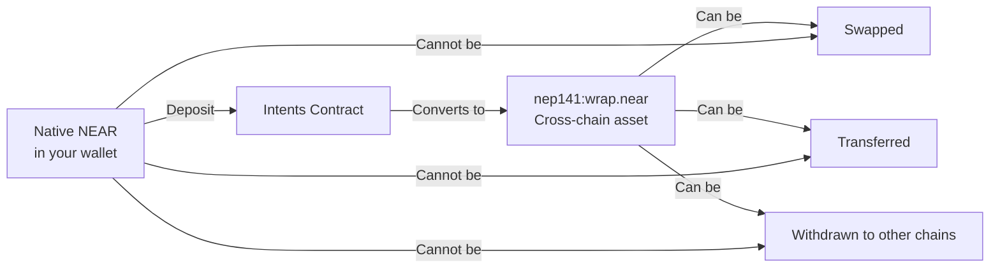

Depositing NEAR Tokens

**Estimated Time:** 20 minutes  
**Prerequisites:** Completed environment setup with funded NEAR account  
**Learning Objectives:**
- Understand the difference between native NEAR and cross-chain NEAR representations
- Execute your first deposit transaction to the Intents contract
- Verify token balances in the multi-asset system
- Learn about token wrapping for cross-chain compatibility

## Introduction

In the previous module, you set up your development environment and verified everything is working. Now it's time for your first hands-on experience: depositing NEAR tokens into the Intents contract to convert them into cross-chain representations.

## Understanding NEAR Token Forms

**Web2 Parallel:** Think of this like depositing cash into a digital payment account. Your physical cash gets converted into digital credits that can be used for online transactions, transfers, and payments across different platforms.

**Web3 Approach:** When you deposit native NEAR tokens into the Intents contract, they get converted into `nep141:wrap.near` tokens - a cross-chain representation that can be swapped, transferred, and used across different blockchain networks.

## Native NEAR vs. Wrapped NEAR



### Key Differences

| Native NEAR | Wrapped NEAR (nep141:wrap.near) |
|-------------|----------------------------------|
| ❌ Cannot be swapped directly | ✅ Can be swapped for any supported token |
| ❌ Limited to NEAR blockchain | ✅ Compatible with cross-chain operations |
| ✅ Used for gas fees | ❌ Cannot pay gas fees directly |
| ✅ Stake for validation | ❌ Cannot be staked |

## Checking Your Starting Balance

Before we make the deposit, let's check your current token balances to understand the before and after state.

### Check Native NEAR Balance
```bash
near account view-account-summary YOUR_ACCOUNT_ID network-config mainnet now
```

You should see something like:
```bash
Account details for 'your-account-id':
  Balance: 0.15 NEAR
  Locked: 0 NEAR
```

### Check Cross-Chain Asset Balances
```bash
near view intents.near mt_batch_balance_of '{
  "account_id": "YOUR_ACCOUNT_ID", 
  "token_ids": [
    "nep141:wrap.near",
    "nep141:eth.bridge.near", 
    "nep141:arb.omft.near"
  ]
}' --networkId mainnet
```

Replace `YOUR_ACCOUNT_ID` with your actual account ID. You'll likely see:
```bash
["0", "0", "0"]
```

This confirms you don't have any cross-chain assets yet.


## Examining the Deposit Code

Let's look at how the deposit function works before running it. Open `src/deposit.ts` in your editor:

```typescript
import { deposit } from './lib/intents';

async function main() {
  console.log('Starting NEAR deposit...');
  
  const result = await deposit({
    inputTokenId: 'near',  // Native NEAR
    outputTokenId: 'nep141:wrap.near',  // Cross-chain NEAR
    inputAmount: '100000000000000000000000',  // 0.1 NEAR in yoctoNEAR
    receiverAddress: process.env.NEAR_ACCOUNT_ID
  });
  
  console.log('Deposit completed:', result);
}

main().catch(console.error);
```

### Key Parameters Explained

- **`inputTokenId: 'near'`**: We're depositing native NEAR tokens
- **`outputTokenId: 'nep141:wrap.near'`**: We want cross-chain NEAR tokens
- **`inputAmount`**: Amount in yoctoNEAR (1 NEAR = 10^24 yoctoNEAR)
- **`receiverAddress`**: Where to send the resulting tokens (your account)

### Amount Calculation
```javascript
// 0.1 NEAR in yoctoNEAR
const amount = 0.1 * Math.pow(10, 24);
console.log(amount); // "100000000000000000000000"
```

## Customizing the Deposit Amount

You can modify the deposit amount in `src/deposit.ts`. Here are some examples:

```typescript
// Deposit 0.05 NEAR (minimum recommended)
inputAmount: '50000000000000000000000'

// Deposit 0.2 NEAR  
inputAmount: '200000000000000000000000'

// Deposit 1 NEAR
inputAmount: '1000000000000000000000000'
```

> **Important:** Keep at least 0.05 NEAR in your account for gas fees. Don't deposit your entire balance.

## Executing Your First Deposit

> **Balance Check:** With 0.2 NEAR provided, the script amounts (0.1 NEAR) work without modification. After registration fees, you'll have ~0.199 NEAR remaining.

Now let's run the deposit script:

```bash
yarn run deposit
```

You should see output similar to:
```bash
Starting NEAR deposit...
Converting 0.1 NEAR to cross-chain representation...
Transaction hash: ABC123XYZ...
Deposit completed: {
  success: true,
  transactionId: "ABC123XYZ...",
  newBalance: "100000000000000000000000"
}
```

## Verifying the Deposit

Let's confirm the deposit worked by checking your balances again.

### Check Updated Native NEAR Balance
```bash
near account view-account-summary YOUR_ACCOUNT_ID network-config mainnet now
```

Your balance should be reduced by approximately 0.1 NEAR plus gas fees:
```bash
Account details for 'your-account-id':
  Balance: 0.048 NEAR  # Reduced from 0.15 NEAR
  Locked: 0 NEAR
```

### Check Updated Cross-Chain Balances
```bash
near view intents.near mt_batch_balance_of '{
  "account_id": "YOUR_ACCOUNT_ID", 
  "token_ids": [
    "nep141:wrap.near",
    "nep141:eth.bridge.near", 
    "nep141:arb.omft.near"
  ]
}' --networkId mainnet
```

Now you should see:
```bash
["100000000000000000000000", "0", "0"]
```

The first value represents your 0.1 NEAR in cross-chain form!

### Understanding Balance Numbers

The balance output uses the smallest token units:
- `100000000000000000000000` represents 0.1 NEAR (yoctoNEAR units)
- `50000000000000000000000` represents 0.05 NEAR (yoctoNEAR units)
- For ETH tokens: `42281346033444` represents ~0.000042 ETH (wei units)

**Quick Conversion**:
- NEAR: divide by 10^24 (1 followed by 24 zeros)
- ETH: divide by 10^18 (1 followed by 18 zeros)

Example: `100000000000000000000000 ÷ 1000000000000000000000000 = 0.1 NEAR`

## Understanding the Transaction

**Web2 Parallel:** This transaction is like converting cash into store credit. Your physical money went into the store's register, and you received digital credits that can be used for purchases within their system and partner networks.

The deposit transaction:
1. Transferred 0.1 native NEAR from your account to the Intents contract
2. The contract minted 0.1 `nep141:wrap.near` tokens to your account
3. These tokens are now available for cross-chain swaps and transfers

## Common Issues and Troubleshooting

### "Account doesn't have enough balance"
- Check your native NEAR balance
- Ensure you're not trying to deposit your entire balance (leave funds for gas)
- Try a smaller amount

### "Transaction failed" 
- Verify your account ID in the environment variables
- Check internet connection
- Ensure the Intents contract is available

### "Amount too small"
We recommend depositing at least 0.05 NEAR. Smaller amounts may be rejected due to minimum thresholds.

## What You've Accomplished

Congratulations! You've successfully:

- ✅ Converted native NEAR to cross-chain NEAR representation
- ✅ Interacted with the NEAR Intents contract
- ✅ Verified the deposit using balance queries
- ✅ Learned the difference between native and wrapped tokens

Your 0.1 NEAR is now available as `nep141:wrap.near` and ready for cross-chain operations.

## Summary

In this section, you learned how to:
- Distinguish between native NEAR and cross-chain NEAR representations
- Execute a deposit transaction to convert between these forms
- Verify successful deposits using balance queries
- Understand the role of token wrapping in cross-chain compatibility

The NEAR tokens in your account are now ready to be swapped for other assets like ETH, enabling true cross-chain functionality.

## Next Steps

With cross-chain NEAR tokens in your account, you're ready to perform your first asset swap. In the next section, we'll swap your NEAR for ETH entirely on the NEAR blockchain.

Continue to [NEAR to ETH Swaps](mdc:../05-asset-swapping/01-near-to-eth.md) 