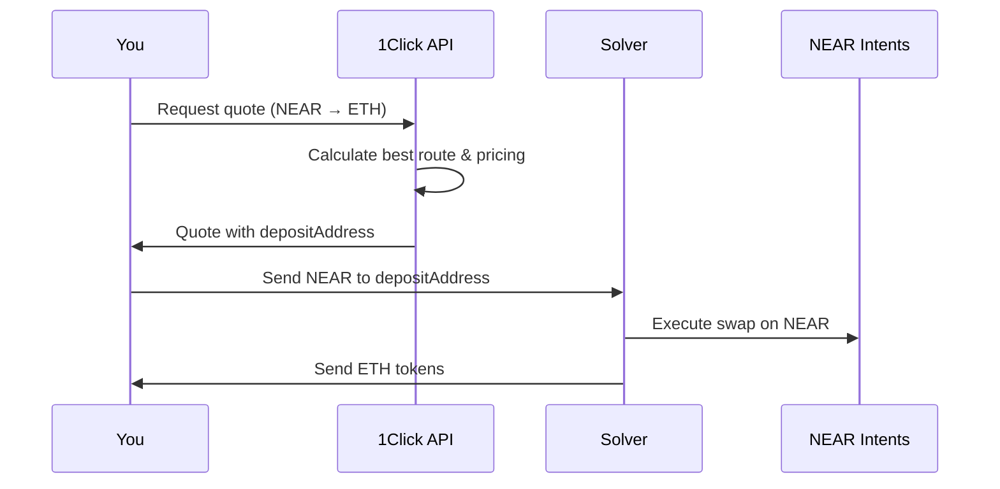

Swapping NEAR for ETH

**Estimated Time:** 25 minutes  
**Prerequisites:** Successfully deposited NEAR tokens (previous module)  
**Learning Objectives:**
- Use the 1Click API to generate swap quotes
- Execute your first cross-chain asset swap
- Understand the quote-to-execution workflow
- Learn about slippage and price impact in cross-chain swaps

## Introduction

In the previous module, you successfully deposited native NEAR tokens and converted them to cross-chain representations. Now comes the exciting part: using the 1Click API to swap your NEAR for ETH entirely on the NEAR blockchain.

## The Magic of On-Chain Cross-Asset Swaps

**Web2 Parallel:** This is like using a universal currency exchange that instantly converts between any two currencies - US dollars to Euros, Yen to British Pounds - all within a single digital platform without involving multiple banks or waiting for international transfers.

**Web3 Approach:** The 1Click API enables you to swap between tokens from completely different blockchains (NEAR ↔ ETH) as if they were native to the same network, all happening instantly on NEAR with minimal fees.

## Understanding the Swap Process



The entire swap happens on NEAR, making it lightning-fast compared to true cross-chain transactions.

## Examining the Swap Code

Let's look at the swap implementation in `src/swap.ts`:

```typescript
import { swap } from './lib/intents';

async function main() {
  console.log('Starting NEAR → ETH swap...');
  
  const result = await swap({
    inputTokenId: 'nep141:wrap.near',  // Cross-chain NEAR
    outputTokenId: 'nep141:eth.bridge.near',  // Cross-chain ETH
    inputAmount: '100000000000000000000000',  // 0.1 NEAR
    depositType: 'INTENTS',  // Source: NEAR Intents  
    recipientType: 'INTENTS',  // Destination: NEAR Intents
    refundTo: process.env.NEAR_ACCOUNT_ID
  });
  
  console.log('Swap completed:', result);
}

main().catch(console.error);
```

### Key Parameters Explained

- **`inputTokenId`**: `nep141:wrap.near` (the cross-chain NEAR from your deposit)
- **`outputTokenId`**: `nep141:eth.bridge.near` (cross-chain ETH representation)
- **`depositType: 'INTENTS'`**: Your funds are already on NEAR Intents
- **`recipientType: 'INTENTS'`**: You want to receive ETH on NEAR Intents
- **`refundTo`**: Where to send tokens if the swap fails

## The INTENTS → INTENTS Advantage

Recall from the 1Click API overview that this parameter combination offers the best performance:

### Benefits
- ✅ **Speed**: 1-2 second finality
- ✅ **Cost**: Low NEAR gas fees only
- ✅ **Simplicity**: Single transaction
- ✅ **Reliability**: No cross-chain bridge risks

### Trade-offs
- ❌ **Token Form**: You receive ETH on NEAR, not native ETH on Ethereum
- ❌ **Usage**: Can't directly use with Ethereum DeFi (until withdrawn)

For most use cases involving further swaps or cross-chain operations, this trade-off is worth it.

## Checking Your Pre-Swap Balances

Before executing the swap, let's verify your current balances:

```bash
near view intents.near mt_batch_balance_of '{
  "account_id": "YOUR_ACCOUNT_ID", 
  "token_ids": [
    "nep141:wrap.near",
    "nep141:eth.bridge.near"
  ]
}' --networkId mainnet
```

You should see something like:
```bash
["100000000000000000000000", "0"]
```

This shows 0.1 NEAR and 0 ETH.

## Understanding Quote Generation

The swap script internally calls the 1Click API to get a quote. Here's what happens:

### Quote Request
```javascript
const quoteRequest = {
  originAsset: 'nep141:wrap.near',
  destinationAsset: 'nep141:eth.bridge.near',
  amount: '100000000000000000000000',
  depositType: 'INTENTS',
  recipientType: 'INTENTS',
  refundTo: 'your-account.near',
  recipient: 'your-account.near',
  deadline: new Date(Date.now() + 15 * 60 * 1000).toISOString()
};
```

### Quote Response
```json
{
  "quote": {
    "depositAddress": "solver123.near",
    "amountIn": "100000000000000000000000",
    "amountInFormatted": "0.1",
    "amountOut": "45678901234567890",
    "amountOutFormatted": "0.000457",
    "deadline": "2025-01-08T15:00:00Z",
    "timeEstimate": 120
  }
}
```

## Customizing the Swap Amount

You can modify the swap amount by editing `src/swap.ts`. Here are some examples:

```typescript
// Swap 0.05 NEAR
inputAmount: '50000000000000000000000'

// Swap 0.2 NEAR
inputAmount: '200000000000000000000000'

// Swap all your NEAR (if you have exactly 0.1)
inputAmount: '100000000000000000000000'
```

Make sure you don't exceed your available `nep141:wrap.near` balance.

## Executing the Swap

Now let's run the swap:

```bash
yarn run swap
```

You should see output similar to:
```bash
Starting NEAR → ETH swap...
Requesting quote from 1Click API...
Quote received: 0.1 NEAR → 0.000456 ETH
Estimated price impact: 0.2%
Executing swap...
Transaction hash: DEF456ABC...
Swap completed: {
  success: true,
  transactionId: "DEF456ABC...",
  inputAmount: "100000000000000000000000",
  outputAmount: "45678901234567890",
  executionTime: "1.2 seconds"
}
```

## Verifying the Swap

Let's check your balances to confirm the swap worked:

```bash
near view intents.near mt_batch_balance_of '{
  "account_id": "YOUR_ACCOUNT_ID", 
  "token_ids": [
    "nep141:wrap.near",
    "nep141:eth.bridge.near"
  ]
}' --networkId mainnet
```

You should now see:
```bash
["0", "45678901234567890"]
```

Your NEAR has been swapped for ETH! The ETH amount will vary based on current exchange rates.

### Understanding Balance Numbers

The balance output uses the smallest token units:
- `0` represents 0 NEAR (yoctoNEAR units)
- `45678901234567890` represents ~0.000456 ETH (wei units)

**Quick Conversion**:
- NEAR: divide by 10^24 (1 followed by 24 zeros)
- ETH: divide by 10^18 (1 followed by 18 zeros)

Example: `45678901234567890 ÷ 1000000000000000000 = ~0.000456 ETH`

## Understanding the ETH Amount

The ETH amount is displayed in wei (smallest ETH unit). To convert to standard ETH:

```javascript
// Convert wei to ETH
const ethAmount = "45678901234567890";
const ethInStandardForm = parseFloat(ethAmount) / Math.pow(10, 18);
console.log(`${ethInStandardForm} ETH`); // ~0.000456 ETH
```

## Price Impact and Slippage

### Price Impact
Price impact represents how much your trade affects the market price:
- **< 1%**: Minimal impact, good trade size
- **1-3%**: Moderate impact, acceptable for most trades  
- **> 3%**: High impact, consider smaller amounts

### Slippage Protection
The 1Click API includes built-in slippage protection:
- Quotes are valid for a limited time (typically 5-15 minutes)
- If market conditions change significantly, the swap may be rejected
- Failed swaps result in automatic refunds to your `refundTo` address

## What Just Happened?

**Web2 Parallel:** You just exchanged one digital currency for another through an automated exchange that found the best rate across multiple liquidity sources and executed the trade instantly.

Technically, the swap:
1. Generated a quote using current market rates
2. Provided a solver address to send your NEAR
3. The solver executed the swap on NEAR Intents
4. You received equivalent ETH value in your account
5. All happened in ~1-2 seconds with minimal fees

## Common Issues and Troubleshooting

### "Insufficient balance"
- Check your `nep141:wrap.near` balance
- Ensure you're not trying to swap more than you have
- Remember: amounts are in smallest units (yoctoNEAR, wei)

### "Quote expired"
- The 1Click API quote timed out
- Run the script again to get a fresh quote
- Market conditions may have changed

### "Swap failed"
- Check your internet connection
- Verify the 1Click API is operational
- Your tokens will be automatically refunded

### "Price impact too high"
- Try a smaller swap amount
- Market liquidity may be low
- Wait for better market conditions

## Exploring Other Token Swaps

Now that you understand the pattern, you can swap between any supported tokens:

```typescript
// NEAR → Arbitrum ETH
inputTokenId: 'nep141:wrap.near',
outputTokenId: 'nep141:arb.omft.near'

// ETH → Base ETH
inputTokenId: 'nep141:eth.bridge.near',
outputTokenId: 'nep141:base.omft.near'
```

Check available tokens with:
```bash
yarn run tokens
```

## Summary

You've successfully completed your first cross-chain asset swap:

- ✅ Used the 1Click API to generate swap quotes
- ✅ Executed a NEAR → ETH swap entirely on NEAR blockchain
- ✅ Verified the swap results through balance queries
- ✅ Learned about price impact and slippage protection

Your ETH tokens are now ready for further operations, including withdrawing to other blockchains.

## Next Steps

With ETH tokens in your account, you're ready to explore cross-chain withdrawals. In the next section, we'll move your ETH from NEAR to the Arbitrum blockchain.

Continue to [Cross-Chain Withdrawals](mdc:../06-cross-chain-withdrawals/01-eth-to-arbitrum.md) 