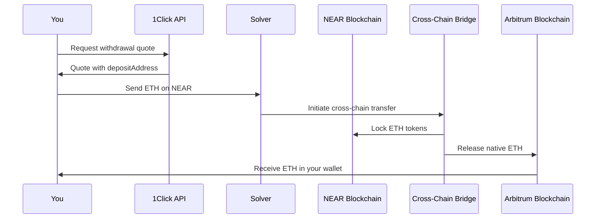
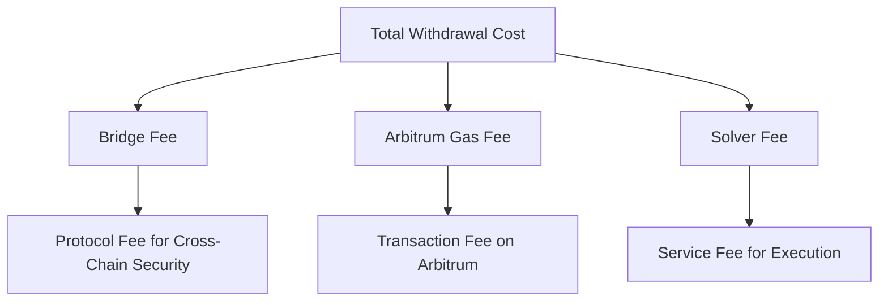

# 6.1: Withdrawing ETH to Arbitrum

**Estimated Time:** 30 minutes  
**Prerequisites:** Successfully swapped NEAR for ETH (previous module)  
**Learning Objectives:**
- Understand cross-chain withdrawals vs. on-chain swaps
- Configure withdrawal parameters for EVM chains
- Execute a withdrawal from NEAR to Arbitrum
- Verify the transaction on both NEAR and Arbitrum

## Introduction

In the previous module, you swapped NEAR for ETH entirely within the NEAR ecosystem. Now you'll learn how to move those ETH tokens to a different blockchain - Arbitrum - enabling you to use them in the broader Ethereum ecosystem.

## Cross-Chain Withdrawals vs. On-Chain Swaps

**Web2 Parallel:** This is like transferring money from your digital wallet back to your traditional bank account. While your previous swap was like exchanging currencies within the same digital platform, a withdrawal actually moves funds between different financial systems.

**Web3 Approach:** Cross-chain withdrawals involve bridge protocols that lock tokens on one chain and release equivalent tokens on another chain, enabling true interoperability between blockchain ecosystems.

## Understanding the Withdrawal Process



This process takes longer than on-chain swaps (typically 2-15 minutes) but gives you native tokens on the destination chain.

## Preparing for Cross-Chain Withdrawal

### Check Your Current ETH Balance
First, let's verify you have ETH to withdraw:

```bash
near view intents.near mt_batch_balance_of '{
  "account_id": "YOUR_ACCOUNT_ID", 
  "token_ids": ["nep141:eth.bridge.near"]
}' --networkId mainnet
```

You should see your ETH balance from the previous swap.

### EVM Private Key Requirement
Cross-chain withdrawals require an EVM-compatible wallet address. Ensure your `.env` file contains:

```bash
EVM_PRIVATE_KEY=your_arbitrum_wallet_private_key
```

> **Security Note:** Use a test wallet for this workshop. Never use private keys from wallets containing significant funds.

## Examining the Withdrawal Code

Let's look at the withdrawal implementation in `src/withdraw.ts`:

```typescript
import { withdraw } from './lib/intents';

async function main() {
  console.log('Starting ETH withdrawal to Arbitrum...');
  
  const result = await withdraw({
    inputTokenId: 'nep141:eth.bridge.near',  // ETH on NEAR
    outputTokenId: 'native-eth-arbitrum',    // Native ETH on Arbitrum
    inputAmount: '45678901234567890',        // Your ETH amount
    depositType: 'INTENTS',                  // Source: NEAR Intents
    recipientType: 'ORIGIN_CHAIN',           // Destination: Arbitrum
    receiverAddress: process.env.EVM_ADDRESS, // Your Arbitrum wallet
    refundTo: process.env.NEAR_ACCOUNT_ID
  });
  
  console.log('Withdrawal completed:', result);
}

main().catch(console.error);
```

### Key Parameters Explained

- **`inputTokenId`**: `nep141:eth.bridge.near` (ETH on NEAR Intents)
- **`outputTokenId`**: `native-eth-arbitrum` (native ETH on Arbitrum)
- **`depositType: 'INTENTS'`**: Source funds from NEAR Intents
- **`recipientType: 'ORIGIN_CHAIN'`**: Receive on the original chain (Arbitrum)
- **`receiverAddress`**: Your Arbitrum wallet address

## INTENTS → ORIGIN_CHAIN Pattern

This parameter combination is specifically for withdrawals:

### Characteristics
- ✅ **True Cross-Chain**: Moves tokens between different blockchains
- ✅ **Native Tokens**: Receive native ETH on Arbitrum (usable everywhere)
- ❌ **Slower**: Takes 2-15 minutes for cross-chain confirmation
- ❌ **Higher Fees**: Includes bridge fees and destination chain gas

### Use Cases
- Moving funds to use in destination chain DeFi
- Converting cross-chain representations back to native tokens
- Portfolio rebalancing across chains
- Exiting the NEAR ecosystem

## Customizing the Withdrawal

Before running the script, you need to configure several parameters:

### 1. Withdrawal Amount
Update the `inputAmount` in `src/withdraw.ts`:

```typescript
// Withdraw all your ETH (use your exact balance)
inputAmount: '45678901234567890'

// Withdraw half your ETH 
inputAmount: '22839450617283945'

// Leave some ETH on NEAR for future operations
inputAmount: '40000000000000000'
```

> **Important:** You cannot withdraw your entire balance if bridge fees are deducted from the input amount. Leave a small buffer or check the quote for exact requirements.

### 2. Receiver Address
Set your Arbitrum wallet address in `src/withdraw.ts`:

```typescript
receiverAddress: '0x1234567890123456789012345678901234567890'
```

This should be an Ethereum-compatible address you control.

## Understanding Withdrawal Fees

Cross-chain withdrawals involve multiple fee components:

### Fee Structure


### Typical Fee Ranges
- **Bridge Fee**: $1-5 USD equivalent
- **Arbitrum Gas**: $0.10-0.50 USD
- **Solver Fee**: 0.1-0.3% of amount
- **Total**: Usually $2-10 USD for typical amounts

## Executing the Withdrawal

Now let's run the withdrawal script:

```bash
yarn run withdraw
```

You should see output similar to:
```bash
Starting ETH withdrawal to Arbitrum...
Requesting withdrawal quote...
Quote received:
  Input: 0.000456 ETH on NEAR
  Output: 0.000430 ETH on Arbitrum
  Bridge fee: 0.000025 ETH
  Estimated time: 5-10 minutes
Executing withdrawal...
Transaction hash on NEAR: GHI789JKL...
Withdrawal initiated successfully.
Monitor Arbitrum transaction at: https://arbiscan.io/tx/0xabc123...
```

## Monitoring the Withdrawal

Cross-chain withdrawals require monitoring on both chains:

### 1. NEAR Transaction
Check your NEAR transaction:
```bash
near transaction view-status GHI789JKL... --networkId mainnet
```

This confirms your ETH was sent to the bridge solver.

### 2. Arbitrum Transaction
Visit the Arbitrum explorer link provided in the output, or manually check:
- Go to [Arbiscan.io](mdc:https://arbiscan.io)
- Search for your wallet address
- Look for incoming ETH transaction

### 3. Balance Verification
Check your NEAR balance to confirm ETH was deducted:
```bash
near view intents.near mt_batch_balance_of '{
  "account_id": "YOUR_ACCOUNT_ID", 
  "token_ids": ["nep141:eth.bridge.near"]
}' --networkId mainnet
```

You should see reduced or zero ETH balance.

## Understanding Withdrawal Timing

### Typical Timeline
1. **0-30 seconds**: NEAR transaction confirms
2. **30 seconds - 2 minutes**: Solver detects and processes
3. **2-15 minutes**: Cross-chain bridge execution
4. **Total**: Usually 5-15 minutes end-to-end

### Factors Affecting Speed
- **Bridge Congestion**: High usage can slow processing
- **Gas Prices**: High Arbitrum gas can delay execution
- **Solver Efficiency**: Different solvers have different speeds
- **Amount Size**: Larger amounts may require additional confirmations

## Troubleshooting Common Issues

### "Insufficient balance for withdrawal"
- Check your exact ETH balance first
- Account for bridge fees (may be deducted from input)
- Try a smaller amount

### "Receiver address invalid"
- Ensure you're using a valid Ethereum address (starts with 0x)
- Verify the address has 42 characters (including 0x)
- Test with a small amount first

### "Quote expired"
- Cross-chain quotes expire faster than on-chain quotes
- Re-run the script to get a fresh quote
- Market conditions may have changed significantly

### "Withdrawal stuck/pending"
- Cross-chain transactions can take time
- Check both NEAR and Arbitrum explorers
- Contact solver support if pending > 30 minutes

## Withdrawal Confirmation

Once successful, you'll have:

✅ **Native ETH on Arbitrum**: Usable with any Arbitrum DeFi protocol  
✅ **Reduced NEAR balance**: ETH removed from NEAR Intents  
✅ **Cross-chain experience**: Understanding of true blockchain interoperability  

## Reverse Operations

You can also deposit ETH from Arbitrum back to NEAR:

```typescript
// This would be the reverse operation
{
  inputTokenId: 'native-eth-arbitrum',
  outputTokenId: 'nep141:eth.bridge.near', 
  depositType: 'ORIGIN_CHAIN',     // From Arbitrum
  recipientType: 'INTENTS'         // To NEAR Intents
}
```

## Summary

You've successfully completed your first cross-chain withdrawal:

- ✅ Moved ETH tokens from NEAR to Arbitrum blockchain
- ✅ Learned about cross-chain bridge mechanics and fees  
- ✅ Experienced true blockchain interoperability
- ✅ Understood the trade-offs between speed and cross-chain functionality

Your ETH is now native on Arbitrum and can be used with any Ethereum-compatible application.

## Next Steps

With experience in deposits, swaps, and withdrawals, you're ready to explore advanced workflows that combine these operations for powerful cross-chain strategies.

Continue to [Advanced Workflows](mdc:../07-advanced-workflows/01-reverse-flows.md) 