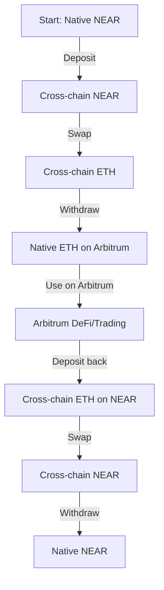
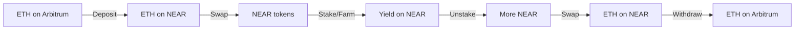

Reverse Flows and Advanced Patterns

**Estimated Time:** 35 minutes  
**Prerequisites:** Completed ETH withdrawal to Arbitrum  
**Learning Objectives:**
- Execute the reverse flow from Arbitrum back to NEAR
- Understand advanced cross-chain workflow patterns
- Learn about liquidity arbitrage opportunities
- Explore multi-hop cross-chain operations

## Introduction

In previous modules, you've learned the fundamental operations: deposit, swap, and withdrawal. Now you'll master advanced workflows that combine these operations in powerful ways, starting with the reverse flow from Arbitrum back to NEAR.

## Understanding Reverse Flows

**Web2 Parallel:** Think of this like a round-trip international money transfer where you can send money to another country, use it there, and then send the remaining funds back home - but with better exchange rates and faster processing than traditional banking.

**Web3 Approach:** Reverse flows enable you to move assets from any supported chain into the NEAR ecosystem, where you can benefit from fast swaps, low fees, and access to NEAR's unique DeFi features.

## The Complete Round-Trip Journey



You've completed the top half. Now let's execute the bottom half.

## Examining the Arbitrum Deposit Code

The reverse flow starts with depositing ETH from Arbitrum back to NEAR. Let's examine `src/deposit_arb.ts`:

```typescript
import { deposit } from './lib/intents';

async function main() {
  console.log('Starting ETH deposit from Arbitrum to NEAR...');
  
  const result = await deposit({
    inputTokenId: 'native-eth-arbitrum',        // Native ETH on Arbitrum
    outputTokenId: 'nep141:arb.omft.near',     // Cross-chain ETH on NEAR
    inputAmount: '40000000000000000',           // Amount in wei
    depositType: 'ORIGIN_CHAIN',                // Source: Arbitrum blockchain
    recipientType: 'INTENTS',                   // Destination: NEAR Intents
    receiverAddress: process.env.NEAR_ACCOUNT_ID,
    refundTo: process.env.EVM_ADDRESS          // Refund to Arbitrum wallet
  });
  
  console.log('Deposit completed:', result);
}

main().catch(console.error);
```

### Key Parameters for Reverse Flow

- **`inputTokenId`**: `native-eth-arbitrum` (your ETH on Arbitrum)
- **`outputTokenId`**: `nep141:arb.omft.near` (cross-chain ETH on NEAR)
- **`depositType: 'ORIGIN_CHAIN'`**: Funds come from Arbitrum
- **`recipientType: 'INTENTS'`**: Deposit into NEAR Intents
- **`refundTo`**: Your Arbitrum address (for failed transactions)

## ORIGIN_CHAIN → INTENTS Pattern

This parameter combination brings external assets into NEAR:

### Characteristics
- ✅ **Cross-Chain Bridge**: Moves tokens from other chains to NEAR
- ✅ **Fast Future Operations**: Enables instant swaps once on NEAR
- ❌ **Bridge Delay**: Initial deposit takes 5-15 minutes
- ❌ **Bridge Fees**: Higher fees for cross-chain operation

### Strategic Benefits
- Access to NEAR's low-fee environment
- Fast arbitrage between different token representations
- Ability to use NEAR DeFi protocols
- Preparation for further cross-chain operations

## Configuring the Arbitrum Deposit

### 1. Check Your Arbitrum ETH Balance
Before depositing, verify you have ETH on Arbitrum:
- Use MetaMask, Arbitrum explorer, or any wallet to check your balance
- Remember to leave some ETH for Arbitrum transaction fees

### 2. Set the Deposit Amount
Update `inputAmount` in `src/deposit_arb.ts`:

```typescript
// Deposit 0.00004 ETH (leaving buffer for fees)
inputAmount: '40000000000000000'

// Deposit 0.0001 ETH  
inputAmount: '100000000000000000'

// Calculate from your available balance (leave ~0.001 ETH for fees)
// If you have 0.00043 ETH, deposit ~0.0004 ETH
inputAmount: '400000000000000000'
```

> **Important:** Always leave some ETH on Arbitrum for transaction fees. Never attempt to deposit your entire balance.

## Executing the Arbitrum Deposit

Run the deposit script:

```bash
yarn run deposit_arbitrum
```

Expected output:
```bash
Starting ETH deposit from Arbitrum to NEAR...
Requesting cross-chain deposit quote...
Quote received:
  Input: 0.00004 ETH on Arbitrum
  Output: 0.000038 ETH on NEAR
  Bridge fee: 0.000002 ETH
  Arbitrum gas: ~$0.15
  Estimated time: 8-12 minutes
Executing cross-chain deposit...
Arbitrum transaction hash: 0xdef456...
Monitoring bridge progress...
Cross-chain deposit completed!
NEAR balance updated.
```

## Monitoring Cross-Chain Deposits

Cross-chain deposits require patience and monitoring:

### Timeline Expectations
1. **0-30 seconds**: Arbitrum transaction confirms
2. **1-3 minutes**: Bridge detects the transaction
3. **5-15 minutes**: Cross-chain processing
4. **Total**: Usually 8-15 minutes

### Monitoring Steps

#### 1. Verify Arbitrum Transaction
- Check the provided transaction hash on [Arbiscan.io](mdc:https://arbiscan.io)
- Confirm the transaction succeeded and gas was paid

#### 2. Check NEAR Balance Updates
Wait for the bridge processing, then verify:

```bash
near view intents.near mt_batch_balance_of '{
  "account_id": "YOUR_ACCOUNT_ID", 
  "token_ids": [
    "nep141:arb.omft.near",
    "nep141:eth.bridge.near"
  ]
}' --networkId mainnet
```

You should see your new ETH balance in the first position.

## Advanced Pattern: Arbitrage Opportunities

With ETH on NEAR from Arbitrum, you can explore arbitrage between different ETH representations:

### Price Discovery
Different ETH representations may have slight price differences:

```typescript
// Compare prices between ETH representations
const quotes = await Promise.all([
  // Arbitrum ETH → NEAR
  get1ClickQuote('nep141:arb.omft.near', 'nep141:wrap.near'),
  // Ethereum ETH → NEAR  
  get1ClickQuote('nep141:eth.bridge.near', 'nep141:wrap.near'),
  // Base ETH → NEAR
  get1ClickQuote('nep141:base.omft.near', 'nep141:wrap.near')
]);
```

### Arbitrage Example
If Arbitrum ETH trades at a premium to Ethereum ETH:
1. Deposit ETH from Arbitrum to NEAR
2. Swap for cheaper Ethereum ETH representation
3. Withdraw to Ethereum at lower cost
4. Bridge back to Arbitrum and capture the spread

## Multi-Hop Cross-Chain Operations

You can chain operations for complex strategies:

### Strategy 1: Cross-Chain Yield Farming


### Strategy 2: Cross-Chain Dollar-Cost Averaging
```typescript
// Automated DCA script concept
async function crossChainDCA() {
  // 1. Deposit stable from multiple chains
  await depositFromChain('USDC', 'ethereum');
  await depositFromChain('USDC', 'arbitrum');
  await depositFromChain('USDC', 'base');
  
  // 2. Swap all to target asset on NEAR
  await swapOnNear('USDC', 'ETH');
  
  // 3. Distribute back to preferred chains
  await withdrawToChain('ETH', 'arbitrum', 50);
  await withdrawToChain('ETH', 'base', 30);
  // Keep 20% on NEAR for future operations
}
```

## Challenge Workflow: Complete Round Trip

Now that you understand all operations, try this complete round trip:

### Phase 1: Arbitrum → NEAR → Back to Arbitrum
1. **Current State**: You have ETH on Arbitrum (from previous withdrawal)
2. **Step 1**: Deposit ETH from Arbitrum to NEAR (`yarn run deposit_arbitrum`)
3. **Step 2**: Swap ETH for NEAR on NEAR Intents
4. **Step 3**: Swap NEAR back to ETH on NEAR Intents  
5. **Step 4**: Withdraw ETH back to Arbitrum

### Implementation Guide

#### Step 2: ETH → NEAR Swap
Create or modify a script to swap your deposited ETH for NEAR:

```typescript
await swap({
  inputTokenId: 'nep141:arb.omft.near',    // Your deposited ETH
  outputTokenId: 'nep141:wrap.near',       // NEAR tokens
  inputAmount: 'your_eth_amount',
  depositType: 'INTENTS',
  recipientType: 'INTENTS'
});
```

#### Step 3: NEAR → ETH Swap
Then swap the NEAR back to ETH:

```typescript
await swap({
  inputTokenId: 'nep141:wrap.near',        // Your NEAR tokens
  outputTokenId: 'nep141:arb.omft.near',  // Back to Arbitrum ETH
  inputAmount: 'your_near_amount',
  depositType: 'INTENTS',
  recipientType: 'INTENTS'
});
```

#### Step 4: Final Withdrawal
Finally, withdraw back to Arbitrum:

```typescript
await withdraw({
  inputTokenId: 'nep141:arb.omft.near',
  outputTokenId: 'native-eth-arbitrum',
  depositType: 'INTENTS',
  recipientType: 'ORIGIN_CHAIN',
  receiverAddress: 'your_arbitrum_address'
});
```

## Gas and Fee Optimization

### Cost Analysis for Round Trips
- **NEAR operations**: ~$0.01-0.10 per swap
- **Cross-chain bridges**: ~$2-10 per bridge
- **Arbitrum gas**: ~$0.10-1.00 per transaction

### Optimization Strategies
1. **Batch Operations**: Perform multiple swaps on NEAR before bridging
2. **Amount Sizing**: Larger amounts have better fee ratios
3. **Timing**: Monitor gas prices on destination chains
4. **Route Selection**: Compare quotes between different ETH representations

## Production Considerations

### Risk Management
- **Bridge Risk**: Cross-chain bridges have smart contract risks
- **Slippage Risk**: Prices can move during longer bridge operations
- **Gas Risk**: Destination chain congestion can increase costs
- **Liquidity Risk**: Large amounts may have higher price impact

### Best Practices
- Start with small amounts to learn the flows
- Always set appropriate `refundTo` addresses
- Monitor transactions on both chains
- Keep buffer funds for gas fees
- Test workflows thoroughly before large amounts

## Summary

You've now mastered advanced cross-chain workflows:

- ✅ Executed reverse flows from external chains to NEAR
- ✅ Understood arbitrage opportunities between token representations
- ✅ Learned multi-hop cross-chain operation patterns
- ✅ Completed complex round-trip scenarios
- ✅ Optimized for fees and gas costs

These skills enable you to build sophisticated cross-chain applications and take advantage of opportunities across the multi-chain ecosystem.

## Next Steps

Congratulations! You've completed the core workshop content. You now have the skills to build cross-chain applications using NEAR Intents and the 1Click API.

Continue to [Workshop Conclusion](mdc:../08-conclusion/01-summary.md) 