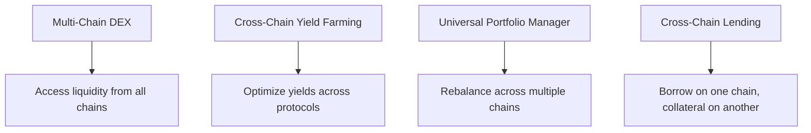
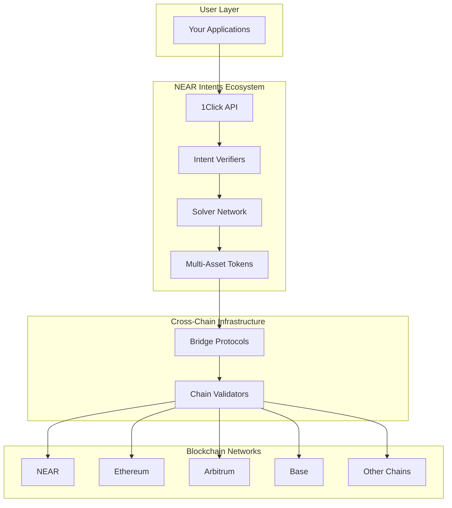

Workshop Summary and Next Steps

**Estimated Time:** 10 minutes  
**Prerequisites:** Completed all previous modules  
**Learning Objectives:**
- Review everything you've accomplished
- Understand the broader implications of cross-chain technology
- Explore next steps for building production applications
- Connect with the NEAR ecosystem for continued learning

## Congratulations! 🎉

You have successfully completed the NEAR Cross-Chain Swaps Workshop! You've gone from understanding basic concepts to executing complex cross-chain workflows using NEAR Intents and the 1Click API.

## What You've Accomplished

### Technical Skills Mastered

#### Core Operations
- ✅ **Token Deposits**: Converting native tokens to cross-chain representations
- ✅ **Asset Swapping**: Using the 1Click API for instant cross-chain swaps
- ✅ **Cross-Chain Withdrawals**: Moving tokens between different blockchains
- ✅ **Balance Management**: Monitoring multi-asset token balances

#### Advanced Workflows
- ✅ **Reverse Flows**: Bidirectional cross-chain operations
- ✅ **Multi-Hop Strategies**: Chaining operations for complex use cases
- ✅ **Arbitrage Opportunities**: Understanding price differences across chains
- ✅ **Fee Optimization**: Minimizing costs in cross-chain operations

#### Development Environment
- ✅ **NEAR CLI Proficiency**: Command-line blockchain interactions
- ✅ **API Integration**: Working with the 1Click API programmatically
- ✅ **Cross-Chain Debugging**: Monitoring transactions across multiple chains
- ✅ **Security Best Practices**: Safe handling of private keys and funds

## The Bigger Picture: What This Enables

**Web2 Parallel:** You've learned to be a "financial translator" who can seamlessly move value between different digital ecosystems, similar to how a skilled forex trader can arbitrage between different currencies and markets globally.

**Web3 Impact:** Your skills enable:

### For Users
- **Seamless UX**: Users can interact with any blockchain without understanding the complexity
- **Best Prices**: Access to liquidity across all supported chains
- **Reduced Friction**: No need to manually bridge or manage multiple wallets

### For Developers  
- **Universal Liquidity**: Build applications that access assets from any chain
- **Simplified Architecture**: Focus on business logic instead of cross-chain complexity
- **Composability**: Combine DeFi primitives across different ecosystems

### For the Ecosystem
- **Increased Adoption**: Lower barriers to cross-chain interactions
- **Capital Efficiency**: Better utilization of liquidity across chains
- **Innovation**: New application patterns previously impossible

## Real-World Applications

The skills you've learned enable building:

### DeFi Applications

### Consumer Applications
- **Universal Wallets**: One interface for all chains
- **Cross-Chain Gaming**: Move assets between different game ecosystems
- **Global Payments**: Send any token to any chain instantly
- **Investment Tools**: Dollar-cost average across multiple assets and chains

### Enterprise Solutions
- **Treasury Management**: Efficiently manage corporate crypto across chains
- **Supply Chain Finance**: Track and transfer value across global networks
- **Cross-Border Payments**: Instant settlements between different regions

## Technical Architecture You Now Understand

You understand how each layer works and how to leverage them for building applications.

## Next Steps: Continuing Your Journey

### Immediate Actions (Next Week)

#### 1. Experiment with Different Tokens
- Try swapping between other supported token pairs
- Explore tokens from different chains (Base, Polygon, etc.)
- Test different amount sizes to understand fee impacts

#### 2. Build a Simple Application
Create a basic web interface that:
- Displays available tokens and current rates
- Allows users to input swap parameters
- Shows transaction status and results
- Provides balance checking functionality

#### 3. Join the Community
- [NEAR Discord](mdc:https://near.chat) - Join #intents channel for discussions
- [NEAR Forum](mdc:https://gov.near.org) - Participate in governance discussions
- [GitHub](mdc:https://github.com/near) - Contribute to open source projects

### Intermediate Goals (Next Month)

#### 1. Advanced Integration Patterns
- Implement automated arbitrage bots
- Create portfolio rebalancing tools
- Build cross-chain notification systems
- Explore MEV opportunities in cross-chain swaps

#### 2. Production Considerations
- Implement proper error handling and retries
- Add monitoring and alerting systems
- Optimize for gas costs and execution speed
- Build comprehensive testing suites

#### 3. Explore NEAR Ecosystem
- **NEAR Social**: Decentralized social protocols
- **NEAR Discovery**: Application discovery platform
- **FastAuth**: Simplified onboarding solutions
- **Account Abstraction**: Advanced wallet features

### Long-term Opportunities (Next Quarter)

#### 1. Build Production Applications
- Launch a cross-chain DEX aggregator
- Create a multi-chain portfolio management tool
- Develop cross-chain gaming infrastructure
- Build enterprise treasury management solutions

#### 2. Contribute to the Ecosystem
- Submit improvement proposals to NEAR protocols
- Develop new solver strategies
- Create educational content for other developers
- Participate in hackathons and developer challenges

## Resources for Continued Learning

### Technical Documentation
- [NEAR Protocol Documentation](mdc:https://docs.near.org)
- [1Click API Reference](mdc:https://docs.near-intents.org/near-intents/integration/distribution-channels/1click-api)
- [NEAR Intents Specification](mdc:https://github.com/near/neps)
- [Cross-Chain Bridge Documentation](mdc:https://docs.near.org/bridge)

### Development Tools
- [NEAR CLI Reference](mdc:https://docs.near.org/tools/near-cli)
- [near-api-js Documentation](mdc:https://docs.near.org/tools/near-api-js)
- [NEAR Explorer](mdc:https://explorer.near.org) for transaction monitoring
- [NEAR Wallet](mdc:https://wallet.near.org) for account management

### Community Resources
- [NEAR Developers Telegram](mdc:https://t.me/neardev)
- [Stack Overflow](mdc:https://stackoverflow.com/questions/tagged/nearprotocol)
- [NEAR University](mdc:https://www.near.university)
- [Developer Relations Team](mdc:https://near.org/developers)

## Final Thoughts

You've completed a journey from basic blockchain concepts to advanced cross-chain application development. The skills you've learned position you at the forefront of Web3 innovation.

### Key Takeaways
1. **Cross-chain is the future**: Multi-chain ecosystems are becoming the norm
2. **User experience matters**: Hiding complexity while maintaining functionality is crucial
3. **Composability is powerful**: Combining primitives across chains unlocks new possibilities
4. **Community is essential**: Engaging with the ecosystem accelerates learning and opportunities

### Your Next Challenge

Take everything you've learned and build something unique. Whether it's solving a specific problem you've encountered, improving on existing solutions, or creating entirely new application categories - you now have the tools and knowledge to make it happen.

The future of Web3 is cross-chain, and you're now equipped to help build it.

## Workshop Feedback

We'd love to hear about your experience! Please share:
- What was most valuable to you?
- Which concepts were challenging?
- What additional topics would be helpful?
- How will you apply these skills?

Your feedback helps us improve the workshop for future developers.

## Thank You!

Thank you for participating in the NEAR Cross-Chain Swaps Workshop. You've joined a community of developers building the future of decentralized finance and cross-chain interoperability.

Keep building, keep learning, and welcome to the NEAR ecosystem! 🚀

---

*Ready to dive deeper? Explore the [NEAR Ecosystem](mdc:https://near.org/ecosystem) to discover more tools, protocols, and opportunities for your next project.* 